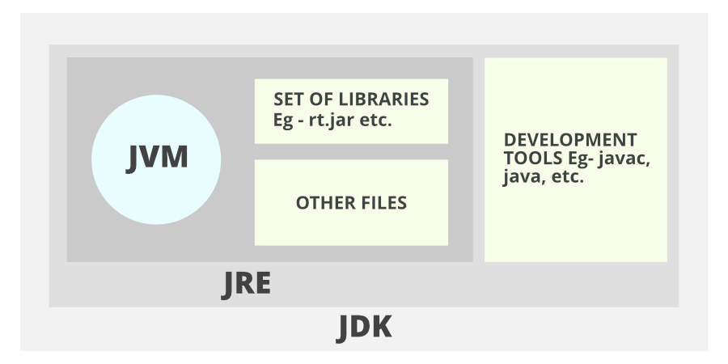

## Notes :

Java is a high-level, object-oriented, robust, platform-independent, high performance, Multithreaded, and portable programming language.
Java uses a single inheritance tree because all classes are the child of Object class in java.

 

Memory areas allocated by JVM - 
Class(Method) Area - stores class structures, fields, method data and method code.
Heap - runtime data area where memory is allocated to objects.
Stack - holds local variables and partial results, method invocation and return addresses, each thread has a private JVM stack.
Program Counter Register - stores address of instruction currently being executed.
Native method stack - methods that are implemented in other languages, that are used in the application.

OOPS - Programming paradigm based on objects having data and methods defined in its class. Advantages - modularity and reusability.
Pillars of OOPs
1. Abstraction - hiding the implementation details and showing only functionality to the user.
2. Encapsulation - data-hiding, wrapping data in a single unit prevents the data inside from being accessed by outside code
3. Inheritance - allows subclass to use fields and methods of superclass
4. Polymorphism - means many forms, overloading - allows same named methods with different signatures; overriding - allows subclass to overwrite methods of superclass

**static methods** - belong to the class rather than object, don't need to create object to access static methods, can access and change the value of static variables, 
cannot use non-static fields or methods directly, cannot use this and super as they are non-static, can't override static methods.

**super** keyword in Java is a reference variable that is used to refer to the immediate parent class object. Whenever you create the instance of the subclass, an instance of the parent class is created implicitly which is referred by super reference variable. 
super() is called in the class constructor implicitly by the compiler if there is no super or this. super and this must be the first statement inside constructor.

covariant return type - since java5, it is possible to override any method by changing the return type if the return type of the subclass overriding method is subclass type.
class A{  
 A get(){ return this; }  
}

class B1 extends A{  
 B1 get(){ return this; }  
 void message(){ System.out.println("covariant return type"); }
}

public static void main(String args[]){  
 new B1().get().message(); 
}  

**final** keyword - final variables can't be modified, final variable which is not assigned to any value can only be assigned through the class constructor
final method can't be overridden, final class can't be inherited.

*Spring Boot*

Java-based spring framework used for Rapid Application Development (to build stand-alone microservices)
-- has auto configuration
-- embedded application server like tomcat,jetty
